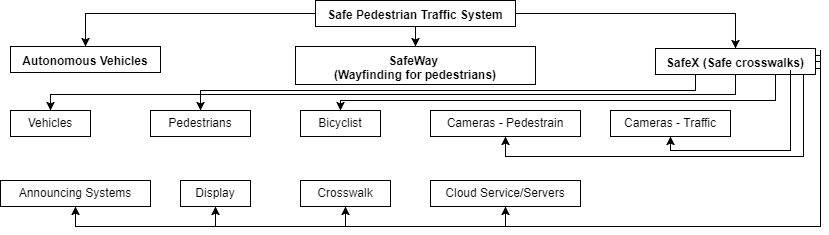
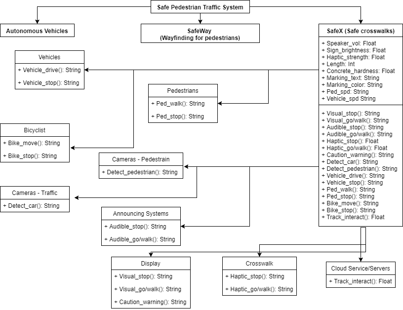
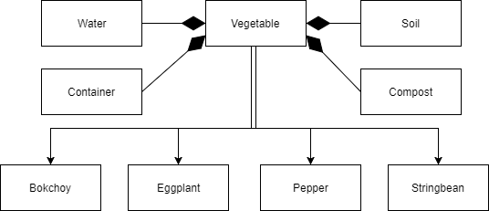

# Assignment1 - Practice Designing Models

> * Participant name: Jared Clark
> * Project Title: Safe Pedestrian Traffic System - SafeX (Safe Crosswalks)

## General Introduction

A **smart city** is an urban area that uses different types of electronic data collection sensors to supply information which is used to manage assets and resources efficiently.

The primary motavation for the a safe pedestrian traffic system is to provide a safe commuter expereince for citizens with visual, hearing, cognitive, and physical disabilities. While the main goal was to increase the mobility and self-reliance capabilities of disabilied citizens, all citizens will benefit from the safe pedestrian traffic system. Bicyclists and drivers will also benefit from the safe pedestrian traffic system by providing advanced alerts.
This idea was adapted form the City of Orlando's proposal titled Accessible Transportation Technology Research Initiative (ATTRI). Several other cities have adopted similar incintatives to address these problems. The City of Orlando proposed safe traffic system is called SafeX (pronounced Safe Cross) which is also the adopted name of this project.
The Florida Department of Transportation (FDOT) has a program in place called PedSafe meant to reduce pedestrian involved accidents. There are two other programs that have tackled the safe pedestrian traffic system: the United States Department of Transportation (USDOT) Savari SmartCross and Dartmouth University's WalkSafe.
Resource: (http://www.cityoforlando.net/greenworks/wp-content/uploads/sites/9/2014/10/City-of-Orlando-Attri-Topic-Three-Safe-Intersection-Crossing-Proposal-SafeX-Volume-I.pdf)

## Requirements (Experimental Design)

SafeX system will set the following requirements:
* 50% reduction in pedestrian and bicycle incidents overall
* 80% reduction in pedestrian and bicycle fatalities overall
* 50% reduction in pedestrian and bicycle incidents involving citizens with disabilities (hearing, vision, cognitive, and mobility issues)
* 10% or less of total system alerts are false positives

## Smart City Safe Pedestrian Traffic System Model

* [**SafeX Object Diagram**]

* [**SafeX Class Diagram**] 

## Smart City Safe Pedestrian Traffic System Simulation

This problem could be simulated as a continuous, discrete, or an agent-based simulation. For this particular situation a continuous simulation was chosen to assist in identifing material requirements. [**(Safe Traffic System Sim)**](analysis/README.md)

## Smart City Safe Pedestrian Traffic System Model
[**Code template**](code/README.md) - Starting coding framework for the (Safe Pedestrian Traffic System)

## **P**ortable **O**rganic **T**rouble-free **S**elf-watering System (**POTS**) Model
Here [**we provide an overview**](code/POTS_system/README.md) of the **P**ortable **O**rganic **T**rouble-free **S**elf-watering System (**POTS**) Model and provide a source code template.
* [**POTS Object Diagram**]
